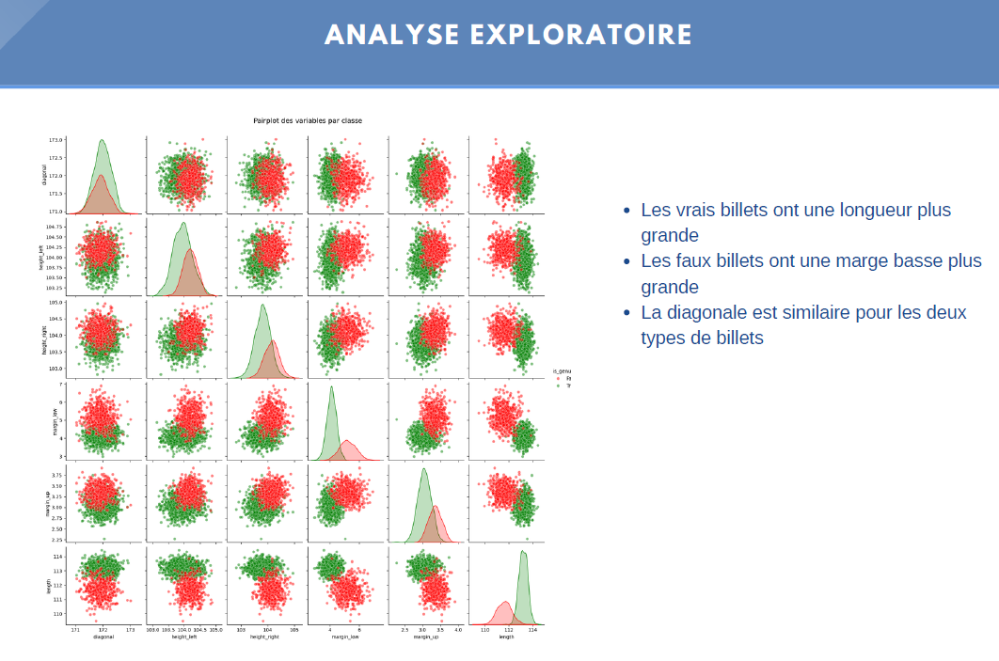

# Détection de faux billets avec Python

**Erika INGABIRE — Data Analyst | Avril 2025**

---

## Contexte

Dans le cadre de la lutte contre la contrefaçon de billets en euros, ce projet vise à automatiser la détection des faux billets. L'objectif est de créer une application de Machine Learning capable de distinguer un vrai billet d'un faux à partir de ses dimensions physiques, afin de protéger l'économie européenne.

---

## Les données

Un fichier CSV contenant 1 500 billets scannés : 1 000 vrais billets et 500 faux billets, décrits par 6 variables géométriques (diagonal, height_left, height_right, margin_low, margin_up, length) et une variable cible is_genuine (1 = vrai, 0 = faux).

---

## Démarche

**Analyse exploratoire** — Distribution des variables, détection de valeurs manquantes (37 sur margin_low, soit 2,47%), matrice de corrélation.

**Traitement des données** — Imputation des valeurs manquantes par régression linéaire pour préserver la structure des données.

**Modélisation** — 4 algorithmes testés sur une séparation 80% train / 20% test avec normalisation StandardScaler :

| Modèle | Accuracy | AUC-ROC | Faux billets manqués |
|--------|----------|---------|----------------------|
| K-Means | 98,67% | 99,92% | 2 |
| Régression Logistique | 99% | 99,95% | 2 |
| KNN | 99% | 99,94% | 2 |
| Random Forest | 99% | 99,92% | 2 |

---

## Résultat

**Meilleur modèle : Régression Logistique** avec un AUC-ROC de 99,95% — simple, rapide, interprétable et fournissant des probabilités de confiance.

L'application finale permet de scanner un billet, saisir ses 6 mesures géométriques et obtenir en quelques secondes : VRAI BILLET ou FAUX BILLET avec la probabilité de confiance associée.

---

## Outils

Python · Pandas · NumPy · Scikit-learn · Matplotlib · Seaborn

---

## Compétences mobilisées

Machine Learning · Classification supervisée · Clustering · Imputation de données · Évaluation de modèles (AUC-ROC, matrice de confusion, F1-Score)
